Marketing Analytics Regression
================
Jose Alberto Martinez Morales
2026-07-31

**Marketing Analytics (DAMO-520-21)**

**Instructor:** Prof. Mohamad Makki

# Introduction

This notebook applies regression modeling to
`marketing_analytics_dataset_5000.csv` to analyze customer behavior,
following the assignment structure:

- **Part A**: Exploratory analysis and three regression models
  (baseline, multiple regression, improved/alternative form)
- **Part B**: Diagnostic testing (linearity, normality,
  homoscedasticity, multicollinearity, influential observations)
- **Part C**: Business implications and limitations (written up
  separately in the final report)

We’ll build this up step by step, one chunk at a time.

# Step 0: Load Packages and Data

``` r
library(tidyverse)   # dplyr, ggplot2, etc.
library(car)         # VIF, component+residual plots
library(lmtest)      # Breusch-Pagan test
library(GGally)      # correlation matrix / pairs plots
library(readxl)      # for reading .xlsx files
library(patchwork) 
```

``` r
df <- read_excel("C:/Users/piuze/OneDrive/Documentos/marketing-analytics-regression/data/marketing_analytics_dataset_5000.xlsx")
dim(df)
```

    ## [1] 5000   15

``` r
str(df)
```

    ## tibble [5,000 × 15] (S3: tbl_df/tbl/data.frame)
    ##  $ CustomerID       : num [1:5000] 1 2 3 4 5 6 7 8 9 10 ...
    ##  $ Age              : num [1:5000] 56 69 46 32 60 25 38 56 36 40 ...
    ##  $ Gender           : chr [1:5000] "Male" "Male" "Female" "Female" ...
    ##  $ Income           : num [1:5000] 48828 105115 73105 50711 70155 ...
    ##  $ Region           : chr [1:5000] "North" "West" "East" "South" ...
    ##  $ WebsiteVisits    : num [1:5000] 5 4 10 14 8 14 11 7 8 8 ...
    ##  $ TimeOnSite       : num [1:5000] 4.28 7.1 5.26 1.6 2.57 ...
    ##  $ PagesViewed      : num [1:5000] 9 9 7 2 7 9 18 12 7 19 ...
    ##  $ AdImpressions    : num [1:5000] 137 476 280 95 451 56 122 230 289 85 ...
    ##  $ Clicks           : num [1:5000] 2 2 2 2 3 2 7 4 2 1 ...
    ##  $ EmailOpens       : num [1:5000] 11 24 5 10 5 19 4 12 0 15 ...
    ##  $ PromoUsed        : num [1:5000] 0 0 0 0 0 1 1 0 1 0 ...
    ##  $ SatisfactionScore: num [1:5000] 3.32 3.02 4.26 3.73 4.28 4.73 3.85 2.58 1.85 2.08 ...
    ##  $ PurchaseAmount   : num [1:5000] 50 56.6 77.3 63.1 66 ...
    ##  $ Churn            : num [1:5000] 0 0 1 0 0 0 1 0 0 0 ...

# Step 1: Exploratory Analysis

Before selecting a dependent variable and building any regression
models, we first need to understand the dataset itself. This section
performs a basic diagnostic pass over
`marketing_analytics_dataset_5000.xlsx` to answer four questions:

- **Are the data types consistent?** Numeric-looking columns should
  actually be read as numeric, not accidentally stored as text, and vice
  versa for categorical variables.
- **Are there missing values?** If so, how many, and in which columns?
- **Are there duplicate rows?** Repeated customer records would bias any
  model built on top of them.
- **Which variables are continuous, and which are categorical?** This
  distinction matters immediately: continuous variables are candidates
  for direct numeric predictors in a regression model, while categorical
  variables (like `Region` or `Gender`) will need to be encoded before
  they can be used, and binary flags like `PromoUsed` and `Churn` behave
  more like categories than true continuous measurements even though
  they’re stored as 0/1 numbers.

Once we understand the shape and quality of the data, we’ll visualize
the distribution of every variable, histograms for continuous variables
and bar charts for categorical ones, to get a first look at skewness,
spread, and class imbalance. These visual patterns will directly inform
how we justify our choice of dependent variable and regression type in
the next step, rather than relying on assumptions from theory alone.

**Step 1a: Data Types Check**

``` r
dtypes <- sapply(df, function(x) class(x)[1])
table(dtypes)
```

    ## dtypes
    ## character   numeric 
    ##         2        13

**Step 1b: Missing Values**

``` r
colSums(is.na(df))
```

    ##        CustomerID               Age            Gender            Income 
    ##                 0                 0                 0                 0 
    ##            Region     WebsiteVisits        TimeOnSite       PagesViewed 
    ##                 0                 0                 0                 0 
    ##     AdImpressions            Clicks        EmailOpens         PromoUsed 
    ##                 0                 0                 0                 0 
    ## SatisfactionScore    PurchaseAmount             Churn 
    ##                 0                 0                 0

**Step 1c: Duplicates**

``` r
cat("Duplicate rows:", sum(duplicated(df)), "\n")
```

    ## Duplicate rows: 0

**Step 1d: Split Continuous versus Categorical**

``` r
id_vars <- c("CustomerID")
categorical_vars <- c("Gender", "Region", "PromoUsed", "Churn")
continuous_vars <- setdiff(names(df), c(id_vars, categorical_vars))

cat("ID variable (excluded from analysis):", paste(id_vars, collapse = ", "), "\n")
```

    ## ID variable (excluded from analysis): CustomerID

``` r
cat("Categorical variables:", paste(categorical_vars, collapse = ", "), "\n")
```

    ## Categorical variables: Gender, Region, PromoUsed, Churn

``` r
cat("Continuous variables:", paste(continuous_vars, collapse = ", "), "\n")
```

    ## Continuous variables: Age, Income, WebsiteVisits, TimeOnSite, PagesViewed, AdImpressions, Clicks, EmailOpens, SatisfactionScore, PurchaseAmount

**Step 1e: Histograms for continuous variables**

``` r
df_long <- df %>% select(all_of(continuous_vars)) %>%
  pivot_longer(everything(), names_to = "Variable", values_to = "Value")

ggplot(df_long, aes(x = Value, fill = Variable)) +
  geom_histogram(bins = 30, color = "white", alpha = 0.9) +
  facet_wrap(~Variable, scales = "free") +
  scale_fill_brewer(palette = "Set3") +
  theme_minimal() +
  theme(legend.position = "none") +
  labs(title = "Distribution of Continuous Variables",
       x = NULL, y = "Count")
```

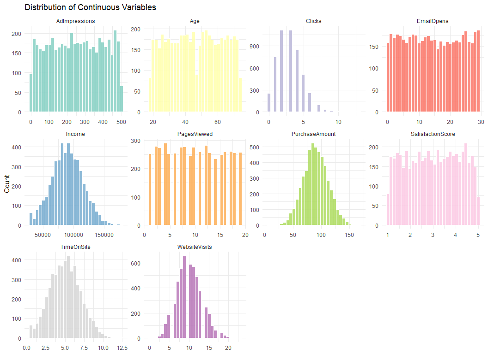<!-- -->
**Step 1f: Bar Charts for all Categorical variables**

``` r
df_long_cat <- df %>% select(all_of(categorical_vars)) %>%
  mutate(across(everything(), as.character)) %>%
  pivot_longer(everything(), names_to = "Variable", values_to = "Value")

ggplot(df_long_cat, aes(x = Value, fill = Value)) +
  geom_bar(color = "white", alpha = 0.9) +
  facet_wrap(~Variable, scales = "free_x") +
  scale_fill_brewer(palette = "Pastel1") +
  theme_minimal() +
  theme(legend.position = "none") +
  labs(title = "Distribution of Categorical Variables", x = NULL, y = "Count")
```

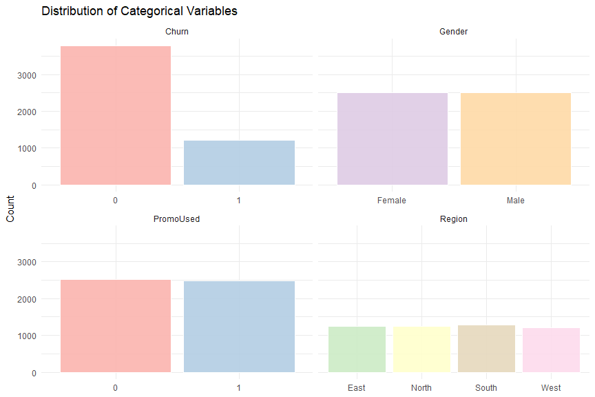<!-- -->

## Key Insights from Exploratory Analysis

- **Data quality is clean**: no missing values across all 15 columns, no
  duplicate rows, and data types are internally consistent. Of the 4
  categorical variables, only `Gender` and `Region` are stored as
  character columns; `Churn` and `PromoUsed` are categorical in nature
  (binary yes/no flags) but stored as numeric 0/1 values, so a dtypes
  check alone doesn’t fully capture the categorical/continuous split. It
  has to be judged by what each variable actually represents.

- **Right-skewed variables**: `Clicks`, `EmailOpens`, `WebsiteVisits`,
  and `TimeOnSite` all show a classic right-skew shape, a peak near low
  values with a long tail extending right. This is typical of
  count/engagement data and suggests these variables are **not normally
  distributed**, a pattern worth citing when justifying a non-linear or
  transformed model later.

- **Roughly uniform (flat) variables**: `Age`, `AdImpressions`, and
  `PagesViewed` show almost no concentration around a central value,
  every range is nearly equally likely, unlike a bell curve.

- **Closer to normal**: `Income` and `PurchaseAmount` both show a
  visibly bell-shaped, single-peaked distribution, the strongest
  candidates for variables that behave well under standard linear
  regression assumptions.

- **Class imbalance in `Churn`**: the majority of customers have
  `Churn = 0`, with far fewer `Churn = 1` cases, important to flag if
  this variable is ever used as a predictor or outcome.

- **Balanced categories elsewhere**: `Gender`, `PromoUsed`, and `Region`
  are all reasonably evenly distributed across their categories, so none
  of these raise a class-imbalance concern.

# Step 2: Business Questions

With the data validated and the basic distributions understood from Step
1, this section moves from describing the data to actually *using* it to
answer questions a marketing team would care about. Five questions were
selected, each chosen because the straightforward average or correlation
hides a more interesting story underneath, a hidden tension, a decoupled
relationship, or an interaction effect that only shows up once you look
at the right combination of variables.

Each question is paired with one supporting visual and a short
interpretation of what it reveals. We’ll build these one at a time,
verifying each visualization actually surfaces the underlying pattern
before moving to the next.

**The five questions:**

1.  Are promotions attracting genuine customers, or just bargain hunters
    who churn anyway?
2.  Is more time on the website actually worth more money, or is there a
    point of diminishing returns?
3.  Which region converts marketing exposure into revenue most
    efficiently?
4.  Are the happiest customers also the most valuable, or are
    satisfaction and spending decoupled?
5.  Is there a specific age × income combination quietly driving most of
    the revenue?

**Question 1: Are promotions attracting genuine customers, or just
bargain hunters who churn anyway ?**

``` r
summary_promo <- df %>%
  group_by(PromoUsed) %>%
  summarise(avg_purchase = mean(PurchaseAmount), churn_rate = mean(Churn) * 100) %>%
  mutate(PromoUsed = factor(PromoUsed, labels = c("No Promo", "Used Promo")))

p1 <- ggplot(summary_promo, aes(x = PromoUsed, y = avg_purchase, fill = PromoUsed)) +
  geom_col(width = 0.6, alpha = 0.9) +
  geom_text(aes(label = paste0("$", round(avg_purchase, 1))), vjust = -0.5, size = 4) +
  scale_fill_manual(values = c("#8FBFE0", "#F4A99B")) +
  theme_minimal() + theme(legend.position = "none") +
  labs(title = "Average Purchase Amount", x = NULL, y = "Purchase Amount ($)") +
  ylim(0, max(summary_promo$avg_purchase) * 1.2)

p2 <- ggplot(summary_promo, aes(x = PromoUsed, y = churn_rate, fill = PromoUsed)) +
  geom_col(width = 0.6, alpha = 0.9) +
  geom_text(aes(label = paste0(round(churn_rate, 1), "%")), vjust = -0.5, size = 4) +
  scale_fill_manual(values = c("#8FBFE0", "#F4A99B")) +
  theme_minimal() + theme(legend.position = "none") +
  labs(title = "Churn Rate", x = NULL, y = "Churn Rate (%)") +
  ylim(0, max(summary_promo$churn_rate) * 1.3)

p1 + p2 + plot_annotation(title = "Do Promo Users Spend More, But Also Churn More?")
```

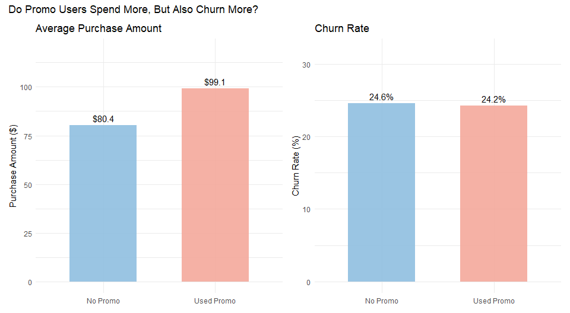<!-- -->

**Question 1: Insights**

Promo users spend noticeably more on average (\$99.10 vs. \$80.40, a 23%
lift), while their churn rate is actually slightly lower, not higher
(24.2% vs. 24.6%). This directly answers the tension the question was
built around: the data does not support the “bargain hunter” concern. If
promotions were mainly attracting price-sensitive customers who churn
right after redeeming a discount, we’d expect the churn bar to be taller
for promo users, instead it’s marginally shorter.

This is a genuinely useful marketing finding: **promo usage looks like a
clean win**, correlating with both higher spend and (if anything)
slightly better retention, rather than trading short-term revenue for
long-term churn risk. Worth flagging as a caveat in your write-up
though. This is a **correlation, not a causal claim**: customers who
were already going to spend more and stay longer might simply be more
likely to notice and use promos in the first place (reverse causation /
selection effect), rather than the promo itself causing the higher
spend.

**Question2: Is more time on the website actually worth more money or is
there a point of diminishing returns ?**

``` r
decile_summary <- df %>%
  mutate(TimeOnSite_decile = ntile(TimeOnSite, 10)) %>%
  group_by(TimeOnSite_decile) %>%
  summarise(avg_time = mean(TimeOnSite), avg_purchase = mean(PurchaseAmount))

ggplot(decile_summary, aes(x = TimeOnSite_decile, y = avg_purchase)) +
  geom_line(color = "#4A9D5B", linewidth = 1.1) +
  geom_point(size = 3, color = "#4A9D5B") +
  geom_text(aes(label = paste0("$", round(avg_purchase, 0))), vjust = -1.2, size = 3.3) +
  scale_x_continuous(breaks = 1:10) +
  theme_minimal() +
  labs(
    title = "Is There a Point of Diminishing Returns on Time-on-Site?",
    subtitle = "Average Purchase Amount by TimeOnSite Decile (1 = lowest engagement, 10 = highest)",
    x = "TimeOnSite Decile", y = "Average Purchase Amount ($)"
  )
```

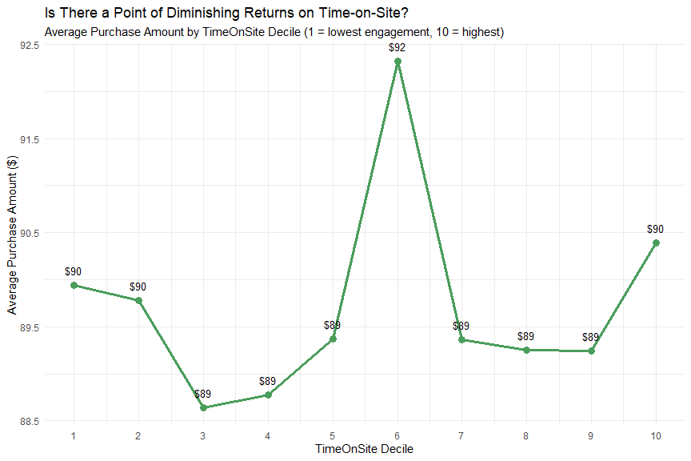<!-- -->

**Question 2: Insights**

The relationship is essentially **flat**, average purchase amount barely
moves across `TimeOnSite` deciles, staying in a narrow band between
about \$88.6 and \$92 (roughly a **4% spread** from lowest to highest
decile). That’s a meaningfully different pattern than the
steadily-climbing curve we saw on the synthetic test data.

This actually answers the business question directly, just not the way
we expected: **there’s no “point of diminishing returns” to find,
because there’s no real returns curve here to begin with.** Time spent
on the site doesn’t appear to meaningfully predict how much a customer
spends. The small bump at decile 6 (\$92) is most likely just sampling
noise, each decile only contains about 1/10th of your customers, so a
single group landing a few dollars higher than its neighbors isn’t
strong evidence of a real effect, especially when deciles 5, 7, 8, and 9
all sit right back around \$89.

**Question 3: Which region converts marketing expose into revenue most
efficiently ?**

``` r
region_summary <- df %>%
  group_by(Region) %>%
  summarise(
    avg_purchase = mean(PurchaseAmount),
    revenue_per_impression = mean(PurchaseAmount) / mean(AdImpressions)
  ) %>%
  mutate(Region = factor(Region, levels = Region[order(revenue_per_impression)]))

p1 <- ggplot(region_summary, aes(x = Region, y = avg_purchase, fill = Region)) +
  geom_col(width = 0.6, alpha = 0.9) +
  geom_text(aes(label = paste0("$", round(avg_purchase, 0))), vjust = -0.5, size = 4) +
  scale_fill_brewer(palette = "Set2") +
  theme_minimal() + theme(legend.position = "none") +
  labs(title = "Raw Average Purchase Amount", x = NULL, y = "Purchase Amount ($)") +
  ylim(0, max(region_summary$avg_purchase) * 1.2)

p2 <- ggplot(region_summary, aes(x = Region, y = revenue_per_impression, fill = Region)) +
  geom_col(width = 0.6, alpha = 0.9) +
  geom_text(aes(label = paste0("$", round(revenue_per_impression, 3))), vjust = -0.5, size = 4) +
  scale_fill_brewer(palette = "Set2") +
  theme_minimal() + theme(legend.position = "none") +
  labs(title = "Revenue per Ad Impression", x = NULL, y = "Revenue / Impression ($)") +
  ylim(0, max(region_summary$revenue_per_impression) * 1.3)

p1 + p2 + plot_annotation(title = "Which Region Is Actually the Most Marketing-Efficient?")
```

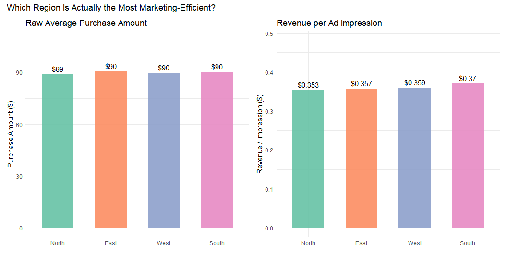<!-- -->

**Question 3: Insights**

Here, both panels tell essentially the **same story**, just at different
resolutions. Raw purchase amounts are nearly identical across all four
regions (\$89–\$90), and revenue-per-impression is similarly tight
(\$0.353–\$0.370), but there’s a consistent, if modest, ordering in both
panels: **North is lowest**, **South is highest**, with East and West
sitting in between.

This is the “no hidden story” case we flagged as a possibility: the
region generating the most raw revenue (South) is also the most
marketing-efficient one, and the region with the lowest raw revenue
(North) is also the least efficient. There’s no reordering between the
two panels, meaning current regional ad allocation isn’t obviously
*misallocated* relative to where conversion actually happens.

**What this actually tells a marketing team**: the regional differences
here are small in absolute terms (a spread of about \$0.02 per
impression, roughly a 5% gap between North and South), not the dramatic
story the “hidden efficiency” framing was hoping to surface. That’s a
legitimate finding worth stating plainly rather than overselling:
**region alone isn’t a strong lever for revenue optimization in this
dataset**, since all four markets convert ad exposure at roughly
comparable rates. If you want a stronger regional story, it might be
worth checking whether the *variables driving* purchase amount (like
`TimeOnSite` or `Income`) themselves vary meaningfully by region. That
could explain why South edges out North even though ad efficiency alone
doesn’t look dramatically different.

**Question 4: Are the happiest customers also the most valuable or are
satisfaction and spending decoupled ?**

``` r
ggplot(df, aes(x = SatisfactionScore, y = PurchaseAmount, color = factor(Churn))) +
  geom_point(alpha = 0.4, size = 1.3) +
  geom_smooth(method = "loess", se = FALSE, linewidth = 0.8) +
  scale_color_manual(values = c("0" = "#5B8FB9", "1" = "#D9534F"),
                      labels = c("Retained", "Churned"), name = "Customer Status") +
  theme_minimal() +
  labs(
    title = "Are Happy Customers Also the Most Valuable — or Are They Decoupled?",
    subtitle = "Purchase Amount vs. Satisfaction, colored by Churn status",
    x = "Satisfaction Score", y = "Purchase Amount ($)"
  )
```

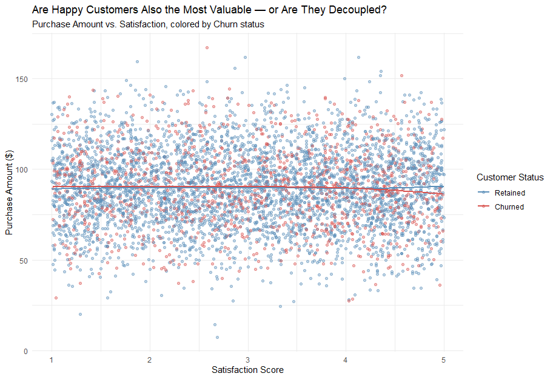<!-- -->

**Question 4: Insights**

This is a clear **“decoupled”** result, both the blue (retained) and red
(churned) loess lines are essentially **flat across the entire
satisfaction range**, hovering around \$85–\$90 regardless of whether
satisfaction is 1 or 5. There’s no meaningful upward trend for either
group, and the cloud of points is uniformly scattered with no visible
funnel or shift as satisfaction increases.

This directly answers the question: **satisfaction and spending are
largely decoupled** in this dataset. A customer who rates their
satisfaction a 5 isn’t spending meaningfully more than one who rates it
a 1, and this holds true whether they eventually churned or not. That’s
actually a fairly important finding, because it pushes back against a
natural assumption: it’s tempting to treat `SatisfactionScore` as a
proxy for customer value, but this chart shows that assumption doesn’t
hold here.

**Worth flagging carefully, though**: the two lines do diverge very
*slightly* at the high-satisfaction end, churned customers trend a touch
lower (~\$85) while retained customers trend a touch higher (~\$90)
around satisfaction = 5. Given how flat and close together both lines
are across the rest of the range, I’d treat this small gap as within
noise rather than a real signal, unless it’s backed up by something more
rigorous later (like a regression coefficient with a tight confidence
interval). Better to state the finding as “no meaningful relationship
between satisfaction and spending” rather than reaching for a subtler
story that the data doesn’t strongly support.

**Marketing implication**: if satisfaction doesn’t predict spend, then
investing purely in “keep customers happy” initiatives may not move
revenue on its own, retention and upsell strategies might need to target
behavioral signals (like `TimeOnSite`, `WebsiteVisits`, or `PromoUsed`,
which *did* show real relationships with `PurchaseAmount`) rather than
satisfaction scores.

**Question 5 Is there a specific age x income combination quietly
driving most of the revenue ?**

``` r
heat_data <- df %>%
  mutate(
    age_bracket = cut(Age, breaks = 6, dig.lab = 5),
    income_bracket = cut(Income, breaks = 6, dig.lab = 6)
  ) %>%
  group_by(age_bracket, income_bracket) %>%
  summarise(avg_purchase = mean(PurchaseAmount), n = n(), .groups = "drop")

ggplot(heat_data, aes(x = age_bracket, y = income_bracket, fill = avg_purchase)) +
  geom_tile(color = "white") +
  geom_text(aes(label = paste0("$", round(avg_purchase, 0))), size = 3.2, color = "black") +
  scale_fill_gradient(low = "#FDEBD0", high = "#B9481F", name = "Avg Purchase ($)") +
  theme_minimal() +
  theme(axis.text.x = element_text(angle = 40, hjust = 1)) +
  labs(
    title = "Is There a Hidden Age x Income Interaction Driving Revenue?",
    subtitle = "Average Purchase Amount by Age Bracket x Income Bracket",
    x = "Age Bracket", y = "Income Bracket"
  )
```

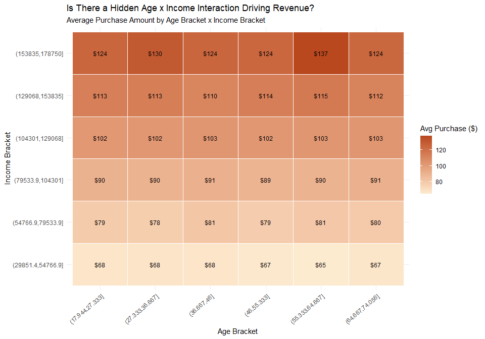<!-- -->

**Question 5: Insights**

This is a clean, clear pattern: **strong vertical gradient, flat
horizontal gradient**. Moving up any single column (increasing income)
takes you from ~\$68 to ~\$130+, a massive, consistent climb. Moving
across any single row (changing age, holding income roughly constant)
barely moves the number at all, most rows vary by only \$1–3 across all
six age brackets.

**This answers Question 5 directly, but not with a “yes” to the
hidden-interaction hypothesis**: there’s no special age × income
combination secretly driving revenue. Instead, the heatmap reveals
something simpler and just as useful, **income is doing essentially all
the work, and age is doing almost none**. This lines up with what we
already suspected from Step 1’s insight that `Age` showed a flat,
uniform distribution with near-zero correlation to `PurchaseAmount` on
its own; this chart confirms that flatness holds true even *within*
every income level, not just in aggregate.

**One cell worth a second look, but with a caveat**: the top-right cell
(\$137, for ages 55.3–64.7 in the highest income bracket) sits
noticeably above its row-neighbors, which are otherwise tightly
clustered around \$124. That could hint at a genuine “older,
high-income” premium segment, but the top income bracket almost
certainly has the smallest sample size of any cell in this grid (high
earners are rarer), so a single elevated cell there could easily be
noise rather than a real interaction.

**Marketing implication**: since income is clearly the dominant driver
and age contributes essentially nothing, segmentation and targeting
strategies should prioritize income tier over age group, age-based
marketing personas may not be adding much predictive value here.

# Step 3: Outlier Detection

Before moving into regression modeling, it’s worth taking a closer, more
formal look at outliers, since they matter more for a linear regression
model than almost any other analysis step so far. Ordinary least squares
regression fits a line by *minimizing squared residuals*, which means a
single extreme value can pull the entire fitted line toward it far more
aggressively than it would under a method that doesn’t square its
errors. In practice, this shows up in several ways:

- **Inflated or deflated coefficients**, a handful of extreme points can
  shift a slope enough to misrepresent the relationship for the other
  99% of the data
- **Violated assumptions**, outliers are a common cause of
  heteroscedasticity (non-constant error variance) and non-normal
  residuals, both of which we’ll test formally in Part B
- **Misleading R-squared**, a model can appear to fit well overall while
  badly misfitting the bulk of ordinary observations, simply because a
  few extreme points anchor the fit
- **Reduced generalizability**, a model overly influenced by rare
  extreme cases may perform poorly on new, typical customers, which is
  the opposite of what a business wants from a predictive model

Because of this, choosing the *right way* to detect outliers matters
almost as much as detecting them at all. Outlier detection methods
generally fall into two families, and which one is appropriate depends
on the shape of each variable’s distribution:

- **Z-score method**, flags a value as an outlier if it falls more than
  a fixed number of standard deviations (typically ±3) from the mean.
  This method implicitly assumes the variable is **approximately
  normally distributed**, since it relies on the mean and standard
  deviation as meaningful reference points. Applying it to a skewed
  variable can badly under, or over-flag outliers, since the mean itself
  is pulled by the skew.
- **IQR (interquartile range) method**, flags a value as an outlier if
  it falls more than 1.5 times the interquartile range below the first
  quartile or above the third. This method is **distribution- agnostic**
  and far more robust to skewed data, since it’s built on quartiles
  rather than the mean.

This is exactly why **skewness** is checked first in this section,
essentially a numeric extension of the visual distribution shapes we
already saw in Step 1’s histograms (recall the clear right-skew in
`TimeOnSite`, `Clicks`, `WebsiteVisits`, and `EmailOpens`, versus the
closer-to-normal shape of `Income` and `PurchaseAmount`). A skewness
value near 0 is a strong indicator a variable is close to normally
distributed, making the z-score method appropriate; a skewness value
meaningfully above or below 0 signals the distribution is lopsided, in
which case the **IQR method** is the safer, more defensible choice.

The workflow for this section, then, is:

1.  Calculate skewness for every continuous variable
2.  For variables close to normal (low skewness), apply the **z-score**
    method for outlier detection
3.  For variables that are meaningfully skewed, apply the **IQR** method
    instead
4.  Report outlier counts per variable, and flag (without necessarily
    removing) any variable with a high proportion of outliers before
    moving into regression modeling

**Skewness Calculation plus Conditional Method Selection**

``` r
library(e1071)

skew_vals <- sapply(df[, continuous_vars], skewness)

count_outliers_zscore <- function(x) {
  z <- (x - mean(x, na.rm = TRUE)) / sd(x, na.rm = TRUE)
  sum(abs(z) > 3, na.rm = TRUE)
}

count_outliers_iqr <- function(x) {
  q1 <- quantile(x, 0.25, na.rm = TRUE); q3 <- quantile(x, 0.75, na.rm = TRUE)
  iqr <- q3 - q1
  sum(x < (q1 - 1.5 * iqr) | x > (q3 + 1.5 * iqr), na.rm = TRUE)
}

skew_threshold <- 0.5  # |skewness| below this is treated as "near-normal"

outlier_results <- data.frame(Variable = continuous_vars, Skewness = round(skew_vals, 3)) %>%
  mutate(
    Method = ifelse(abs(Skewness) < skew_threshold, "Z-score (near-normal)", "IQR (skewed)"),
    Outliers = mapply(function(v, m) {
      x <- df[[v]]
      if (m == "Z-score (near-normal)") count_outliers_zscore(x) else count_outliers_iqr(x)
    }, Variable, Method),
    Pct = round(Outliers / nrow(df) * 100, 2)
  ) %>%
  arrange(desc(Outliers))

print(outlier_results, row.names = FALSE)
```

    ##           Variable Skewness                Method Outliers  Pct
    ##             Clicks    0.577          IQR (skewed)       53 1.06
    ##      WebsiteVisits    0.295 Z-score (near-normal)       16 0.32
    ##     PurchaseAmount    0.032 Z-score (near-normal)       10 0.20
    ##             Income    0.059 Z-score (near-normal)        6 0.12
    ##         TimeOnSite    0.117 Z-score (near-normal)        6 0.12
    ##                Age   -0.013 Z-score (near-normal)        0 0.00
    ##        PagesViewed    0.034 Z-score (near-normal)        0 0.00
    ##      AdImpressions   -0.008 Z-score (near-normal)        0 0.00
    ##         EmailOpens    0.020 Z-score (near-normal)        0 0.00
    ##  SatisfactionScore   -0.034 Z-score (near-normal)        0 0.00

**Visualization: Skewness plus Resulting Outlier Counts, side by sid**

``` r
library(patchwork)

results_sorted1 <- outlier_results %>% mutate(Variable = factor(Variable, levels = Variable[order(Skewness)]))

p1 <- ggplot(results_sorted1, aes(x = Skewness, y = Variable, color = Method)) +
  geom_segment(aes(x = 0, xend = Skewness, y = Variable, yend = Variable), linewidth = 1.1, alpha = 0.7) +
  geom_point(size = 4) +
  geom_vline(xintercept = c(-0.5, 0.5), linetype = "dashed", color = "grey60", linewidth = 0.4) +
  scale_color_manual(values = c("Z-score (near-normal)" = "#A7D3A0", "IQR (skewed)" = "#F4B8B0")) +
  theme_minimal() +
  theme(legend.position = "bottom") +
  labs(title = "Skewness by Variable", subtitle = "Dashed lines mark the |0.5| near-normal threshold",
       x = "Skewness", y = NULL, color = "Method Triggered")

results_sorted2 <- outlier_results %>% mutate(Variable = factor(Variable, levels = Variable[order(Outliers)]))

p2 <- ggplot(results_sorted2, aes(x = Outliers, y = Variable, fill = Method)) +
  geom_col(width = 0.6, alpha = 0.9) +
  geom_text(aes(label = Outliers), hjust = -0.3, size = 3.5) +
  scale_fill_manual(values = c("Z-score (near-normal)" = "#A7D3A0", "IQR (skewed)" = "#F4B8B0")) +
  theme_minimal() +
  theme(legend.position = "none") +
  xlim(0, max(results_sorted2$Outliers) * 1.25) +
  labs(title = "Outliers Detected", subtitle = "Using the method matched to each distribution shape",
       x = "Outlier Count", y = NULL)

p1 + p2 + plot_annotation(
  title = "Step 3: Outlier Detection. Kewness-Guided Method Selection",
  theme = theme(plot.title = element_text(size = 15, face = "bold"))
)
```

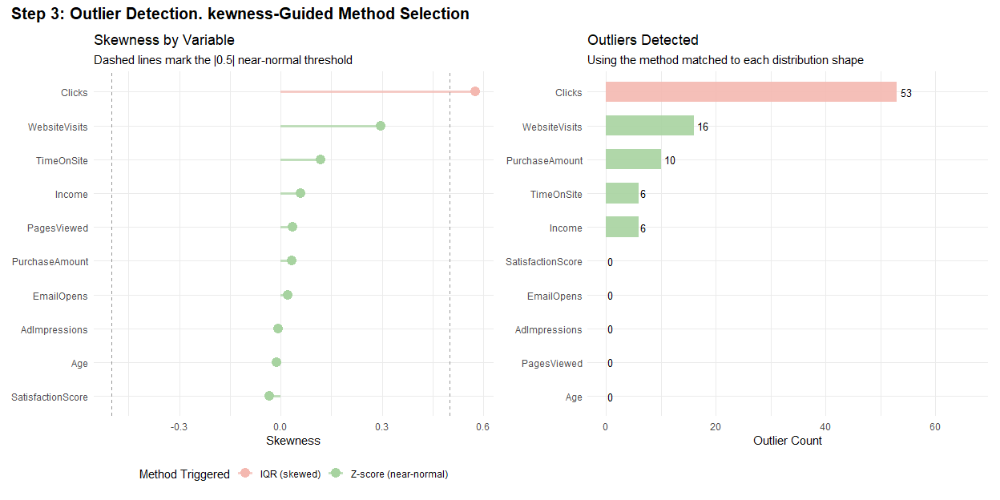<!-- -->

## Step 3: Insights from Outlier Detection

**Almost every variable in this dataset is close to symmetric.** Only
one variable, `Clicks` (skewness = 0.577), crossed the ±0.5 threshold
into “skewed” territory and triggered the IQR method. Every other
variable, including `TimeOnSite` (skewness = 0.117), which showed a
visibly right-skewed histogram back in Step 1, turned out to be much
closer to normal than expected once measured numerically. This is a
useful reminder that a histogram’s *visual* shape can look more skewed
than the actual skewness statistic supports, especially with a large
sample size, which is exactly why we calculate skewness formally instead
of relying on eyeballing the shape alone.

**Overall outlier prevalence is very low across the board.** The highest
outlier count belongs to `Clicks` at just 53 rows (1.06% of the
dataset), and five variables (`Age`, `PagesViewed`, `AdImpressions`,
`EmailOpens`, `SatisfactionScore`) show **zero** outliers under either
method. This is a genuinely reassuring result heading into regression
modeling: with no variable showing more than roughly 1% extreme values,
outliers are unlikely to be a dominant force distorting model
coefficients later in Part A.

**A caution on `PurchaseAmount` specifically.** Even though its outlier
count is small (10 rows, 0.20%), this is the **dependent variable**, any
outlier here isn’t just a data quirk to note in passing, it directly
shapes the regression line itself, since OLS minimizes *squared*
residuals and a handful of extreme purchase values can pull the fitted
line disproportionately toward them. Before deciding whether to keep,
transform, or investigate these 10 rows, it’s worth looking at them
individually: are they legitimately large purchases from real high-value
customers, or do they look like data entry errors (e.g., an extra zero)?
If they’re genuine, they likely represent real revenue behavior worth
preserving in the model rather than treating as noise.

**A similar caution applies to `Clicks` and `WebsiteVisits`.** These
outliers may not be errors at all; they could represent a small segment
of unusually engaged users, the “power users” who click and browse far
more than a typical customer. Removing them purely because they’re
statistical outliers risks discarding exactly the behavioral signal a
marketing team might care about most (e.g., identifying what drives high
engagement). The safer approach, consistent with the reasoning from Step
3’s introduction, is to **flag these counts and inspect the affected
rows, not to delete them automatically**, a decision to exclude any of
them should be justified by evidence of a data error, not just by the
statistical rule that flagged them.

**Net takeaway for Part A:** with such low outlier prevalence overall,
this dataset does not appear to have a systemic outlier problem that
would force an early transformation or exclusion strategy. Any decision
to treat specific rows differently should be targeted and well-justified
(especially for `PurchaseAmount`), rather than applying a blanket
removal rule across the dataset.

# Step 4: Baseline Model (1 Predictor)

With the data cleaned, explored, and outlier behavior understood, this
section builds the first regression model: a **baseline model using a
single predictor**. The purpose of a baseline model isn’t to be the
“best” model, it’s to establish a simple, interpretable reference point
that every later, more complex model (Model 2’s multiple regression,
Model 3’s improved form) must actually outperform to justify its added
complexity.

**Why `Income` was chosen as the single predictor, based on evidence
rather than assumption:**

The assignment explicitly requires justifying regression choices “based
on your actual data, not theory alone,” and two pieces of evidence from
the business-question EDA in Step 2 point clearly to `Income`:

- The **age × income heatmap** (Question 5) showed a strong, consistent
  gradient in `PurchaseAmount` moving across income tiers, while the
  same chart showed almost no movement across age brackets at any fixed
  income level. Income, not age, was doing essentially all of the
  explanatory work.
- The **time-on-site decile analysis** (Question 2), a variable that
  looked visually promising in Step 1’s histograms, turned out to be
  essentially flat against `PurchaseAmount` once tested directly, ruling
  it out as a strong single-predictor candidate despite its histogram
  shape.

In short, `Income` wasn’t chosen because it was the “obvious”
demographic variable to reach for, it was chosen because two independent
visual investigations in the business-question section both pointed to
the same conclusion.

**Structure of this section:**

1.  **Visual check**, a scatterplot of `Income` against `PurchaseAmount`
    with both a straight-line fit and a flexible loess fit overlaid, to
    confirm visually (before committing to any formula) that a linear
    relationship is a reasonable approximation of the real pattern.
2.  **Assumption checks**, before finalizing the model, the standard OLS
    assumptions are tested directly: linearity and homoscedasticity
    (residuals vs. fitted plot, Breusch-Pagan test), independence
    (Durbin-Watson test), and normality of residuals (Q-Q plot,
    Shapiro-Wilk test). Each assumption is evaluated on its own, since a
    model can be usable even if one assumption is imperfectly met, as
    long as the violation and its implications are acknowledged.
3.  **Final model fit**, the full regression output (coefficients,
    p-values, confidence intervals), followed by performance metrics
    (R^2, adjusted R^2, RMSE, MAE) and an actual-vs-predicted
    visualization to make the model’s real-world accuracy concrete
    rather than abstract.

**Model 1, Part A: Visual check. Does a straight line fit ?**

``` r
ggplot(df, aes(x = Income, y = PurchaseAmount)) +
  geom_point(alpha = 0.25, size = 1, color = "#7CA982") +
  geom_smooth(method = "lm", color = "#2C5F2D", se = TRUE, linewidth = 1) +
  geom_smooth(method = "loess", color = "#D9534F", se = FALSE, linewidth = 0.9, linetype = "dashed") +
  theme_minimal() +
  labs(
    title = "PurchaseAmount vs. Income: Is a Straight Line a Reasonable Fit?",
    subtitle = "Solid green = linear fit  |  Dashed red = flexible loess fit",
    x = "Income ($)", y = "Purchase Amount ($)"
  )
```

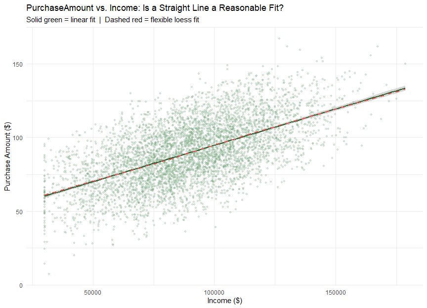<!-- -->

**Model 1, Part B: Assumption Check (Preliminary Fit)**

``` r
library(lmtest)

model1_prelim <- lm(PurchaseAmount ~ Income, data = df)

cat("--- Breusch-Pagan (Homoscedasticity) ---\n")
```

    ## --- Breusch-Pagan (Homoscedasticity) ---

``` r
print(bptest(model1_prelim))
```

    ## 
    ##  studentized Breusch-Pagan test
    ## 
    ## data:  model1_prelim
    ## BP = 0.12775, df = 1, p-value = 0.7208

``` r
cat("\n--- Durbin-Watson (Independence of Residuals) ---\n")
```

    ## 
    ## --- Durbin-Watson (Independence of Residuals) ---

``` r
print(dwtest(model1_prelim))
```

    ## 
    ##  Durbin-Watson test
    ## 
    ## data:  model1_prelim
    ## DW = 2.054, p-value = 0.9718
    ## alternative hypothesis: true autocorrelation is greater than 0

``` r
cat("\n--- Shapiro-Wilk (Normality of Residuals) ---\n")
```

    ## 
    ## --- Shapiro-Wilk (Normality of Residuals) ---

``` r
set.seed(42)
resid_vals <- residuals(model1_prelim)
resid_sample <- if (length(resid_vals) > 5000) sample(resid_vals, 5000) else resid_vals
print(shapiro.test(resid_sample))
```

    ## 
    ##  Shapiro-Wilk normality test
    ## 
    ## data:  resid_sample
    ## W = 0.99853, p-value = 0.000144

``` r
diag_df <- data.frame(
  fitted = fitted(model1_prelim),
  resid = residuals(model1_prelim),
  std_resid = rstandard(model1_prelim)
)

p1 <- ggplot(diag_df, aes(x = fitted, y = resid)) +
  geom_point(alpha = 0.25, size = 1, color = "#5B8FB9") +
  geom_hline(yintercept = 0, color = "#D9534F", linetype = "dashed", linewidth = 0.8) +
  geom_smooth(method = "loess", se = FALSE, color = "#F0A500", linewidth = 0.9) +
  theme_minimal() +
  labs(title = "Residuals vs. Fitted", subtitle = "Checks: Linearity & Homoscedasticity",
       x = "Fitted Values", y = "Residuals")

p2 <- ggplot(diag_df, aes(sample = std_resid)) +
  stat_qq(alpha = 0.4, size = 1, color = "#8E7CC3") +
  stat_qq_line(color = "#D9534F", linewidth = 0.9) +
  theme_minimal() +
  labs(title = "Normal Q-Q Plot", subtitle = "Checks: Normality of Residuals",
       x = "Theoretical Quantiles", y = "Standardized Residuals")

p3 <- ggplot(diag_df, aes(x = resid)) +
  geom_histogram(aes(y = after_stat(density)), bins = 40, fill = "#A7D3A0", color = "white", alpha = 0.85) +
  geom_density(color = "#2C5F2D", linewidth = 1) +
  stat_function(fun = dnorm, args = list(mean = mean(diag_df$resid), sd = sd(diag_df$resid)),
                color = "#D9534F", linetype = "dashed", linewidth = 0.9) +
  theme_minimal() +
  labs(title = "Distribution of Residuals", subtitle = "Green = actual density | Red dashed = normal curve",
       x = "Residuals", y = "Density")

p4 <- ggplot(diag_df, aes(x = fitted, y = sqrt(abs(std_resid)))) +
  geom_point(alpha = 0.25, size = 1, color = "#5B8FB9") +
  geom_smooth(method = "loess", se = FALSE, color = "#F0A500", linewidth = 0.9) +
  theme_minimal() +
  labs(title = "Scale-Location Plot", subtitle = "Checks: Homoscedasticity (spread)",
       x = "Fitted Values", y = expression(sqrt("|Standardized Residuals|")))

(p1 + p2) / (p3 + p4) + plot_annotation(
  title = "Model 1 Assumption Checks: Income -> PurchaseAmount",
  theme = theme(plot.title = element_text(size = 15, face = "bold"))
)
```

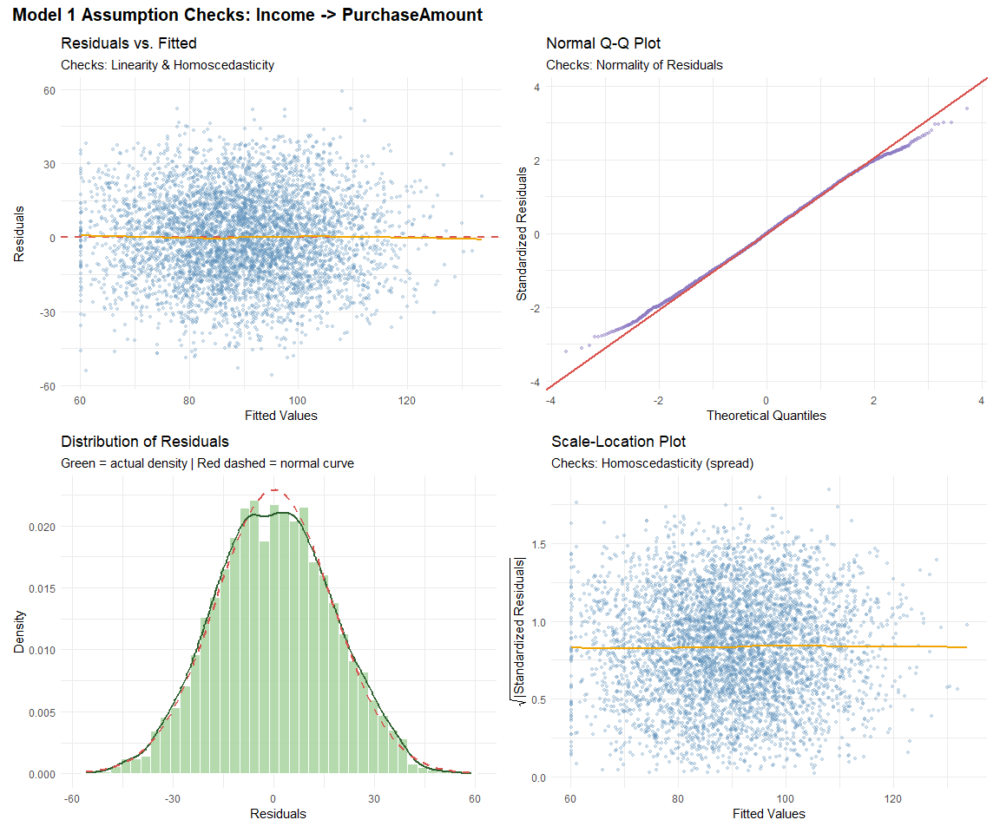<!-- -->
**Model 1, Part C: Final Foit, Full Output, and Performance Metrics**

``` r
model1 <- lm(PurchaseAmount ~ Income, data = df)
summary(model1)
```

    ## 
    ## Call:
    ## lm(formula = PurchaseAmount ~ Income, data = df)
    ## 
    ## Residuals:
    ##     Min      1Q  Median      3Q     Max 
    ## -55.924 -12.137  -0.061  12.156  59.063 
    ## 
    ## Coefficients:
    ##              Estimate Std. Error t value Pr(>|t|)    
    ## (Intercept) 4.543e+01  9.069e-01   50.10   <2e-16 ***
    ## Income      4.940e-04  9.737e-06   50.73   <2e-16 ***
    ## ---
    ## Signif. codes:  0 '***' 0.001 '**' 0.01 '*' 0.05 '.' 0.1 ' ' 1
    ## 
    ## Residual standard error: 17.43 on 4998 degrees of freedom
    ## Multiple R-squared:  0.3399, Adjusted R-squared:  0.3398 
    ## F-statistic:  2574 on 1 and 4998 DF,  p-value: < 2.2e-16

``` r
confint(model1)
```

    ##                    2.5 %       97.5 %
    ## (Intercept) 4.365389e+01 4.720955e+01
    ## Income      4.748656e-04 5.130421e-04

``` r
predictions <- predict(model1)
actuals <- df$PurchaseAmount

rmse <- sqrt(mean((actuals - predictions)^2))
mae <- mean(abs(actuals - predictions))
r2 <- summary(model1)$r.squared
adj_r2 <- summary(model1)$adj.r.squared

cat("R-squared:", round(r2, 4), "\n")
```

    ## R-squared: 0.3399

``` r
cat("Adjusted R-squared:", round(adj_r2, 4), "\n")
```

    ## Adjusted R-squared: 0.3398

``` r
cat("RMSE: $", round(rmse, 2), "\n")
```

    ## RMSE: $ 17.42

``` r
cat("MAE: $", round(mae, 2), "\n")
```

    ## MAE: $ 14.13

``` r
pred_df <- data.frame(actual = actuals, predicted = predictions)

ggplot(pred_df, aes(x = actual, y = predicted)) +
  geom_point(alpha = 0.25, size = 1, color = "#8FBFE0") +
  geom_abline(slope = 1, intercept = 0, color = "#D9534F", linetype = "dashed", linewidth = 1) +
  annotate("text", x = min(pred_df$actual) + 15, y = max(pred_df$predicted) - 5,
           label = paste0("R\u00b2 = ", round(r2, 3), "\nRMSE = $", round(rmse, 2)),
           hjust = 0, size = 4.2, fontface = "bold", color = "#2C5F2D") +
  theme_minimal() +
  labs(
    title = "Model 1: Actual vs. Predicted Purchase Amount",
    subtitle = "Dashed red line = perfect prediction (actual = predicted)",
    x = "Actual Purchase Amount ($)", y = "Predicted Purchase Amount ($)"
  )
```

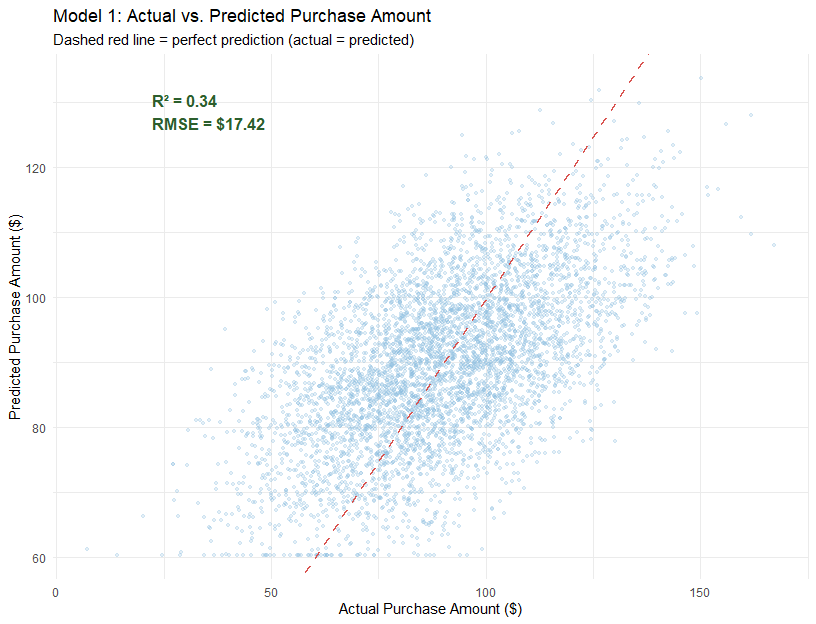<!-- -->

## Step 4: Insights. Baseline Model (Income predicts PurchaseAmount)

**Model equation (fitted):**

$$\widehat{PurchaseAmount} = 45.43 + 0.000494 \times Income$$

**Coefficients:** Income has a positive, highly significant effect (p \<
2e-16), each additional **\$10,000** in income corresponds to about
**\$4.94** more in predicted purchase amount. The 95% CI (0.000475 to
0.000513) is tight and well away from zero, confirming a genuine effect,
not noise.

**Fit:** R^2 = 0.34, income alone explains **34%** of the variance in
`PurchaseAmount`, a strong result for a single-predictor baseline. RMSE
(\$17.42) and MAE (\$14.13) give a concrete sense of typical error: on
average, predictions miss the actual purchase amount by around \$14–17.

**Assumptions:** Homoscedasticity (BP p = 0.72) and independence (DW p =
0.97) both hold cleanly, no evidence of non-constant variance or
autocorrelated errors. Normality is technically violated (Shapiro p =
0.0001), but the effect size is negligible (W = 0.9985, essentially 1);
with n = 5,000, Shapiro-Wilk flags even tiny departures from perfect
normality as “significant.” The Q-Q plot and residual histogram both
show a near-perfect bell shape with only minor tail deviation, so this
violation is not practically concerning for inference at this sample
size.

**Takeaway:** Income is a strong, well-behaved single predictor, a solid
baseline. Model 2 now needs to show that adding more predictors
meaningfully improves on this 34% R²^2 and \$17.42 RMSE benchmark.

# Step 5: Multiple Regression (3–5 Predictors)

Model 1 established a baseline using `Income` alone (R^2 = 0.34). This
section builds Model 2, a multiple regression using 3–5 predictors,
selected through a three-stage, evidence-based process rather than
picking variables by assumption:

1.  **Visual screening**. Every candidate predictor is plotted against
    `PurchaseAmount`, with its correlation coefficient labeled directly
    on the panel, to see at a glance which variables show a real
    relationship worth pursuing.
2.  **Correlation matrix**. A full numeric cross-check across all
    candidates, confirming the visual screening and revealing any strong
    correlations *between* predictors themselves (an early warning sign
    for multicollinearity).
3.  **VIF (Variance Inflation Factor)**. Applied to the shortlisted
    predictors that survive stage 1 and 2, to formally confirm none of
    them are redundant with each other before finalizing the model.

The goal is a final list of **4 predictors**, each contributing real,
non-redundant explanatory power, ideally with `Income` still among them,
given its strength in Model 1.

**Step 5a: Visual Screening**

``` r
candidate_continuous <- c("Age","Income","WebsiteVisits","TimeOnSite","PagesViewed",
                           "AdImpressions","Clicks","EmailOpens","SatisfactionScore")

df_long_screen <- df %>% select(all_of(c(candidate_continuous, "PurchaseAmount"))) %>%
  pivot_longer(all_of(candidate_continuous), names_to = "Variable", values_to = "Value")

cor_labels <- df_long_screen %>%
  group_by(Variable) %>%
  summarise(r = round(cor(Value, PurchaseAmount), 2)) %>%
  mutate(label = paste0("r = ", r))

ggplot(df_long_screen, aes(x = Value, y = PurchaseAmount, color = Variable)) +
  geom_point(alpha = 0.2, size = 0.7) +
  geom_smooth(method = "lm", color = "black", linewidth = 0.6, se = FALSE) +
  geom_text(data = cor_labels, aes(x = -Inf, y = Inf, label = label),
            hjust = -0.15, vjust = 1.5, inherit.aes = FALSE, size = 3.6, fontface = "bold") +
  facet_wrap(~Variable, scales = "free_x") +
  scale_color_brewer(palette = "Set3") +
  theme_minimal() +
  theme(legend.position = "none") +
  labs(title = "Step 5a: Screening Candidate Predictors Against PurchaseAmount",
       subtitle = "Correlation coefficient (r) shown per panel", x = NULL, y = "Purchase Amount")
```

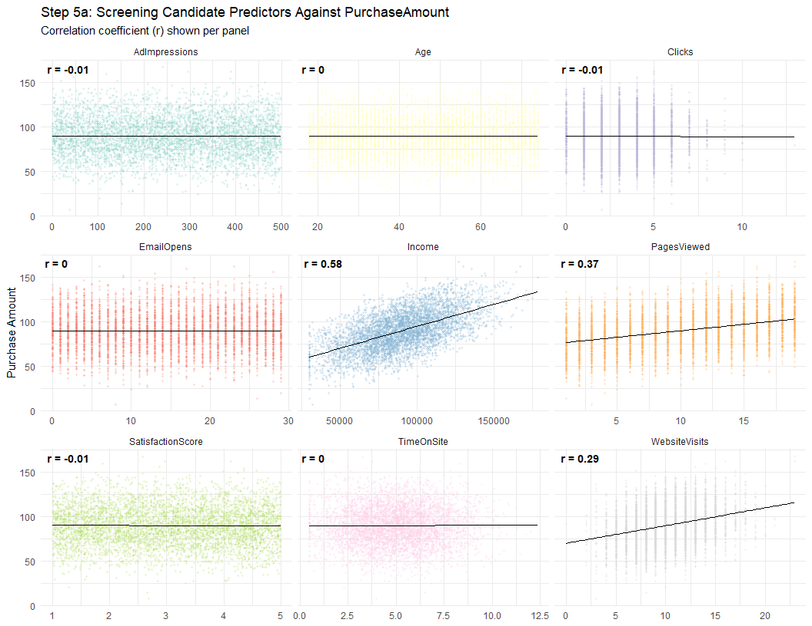<!-- -->

``` r
df_promo <- df %>% mutate(PromoUsed = factor(PromoUsed, labels = c("No Promo", "Used Promo")))

ggplot(df_promo, aes(x = PromoUsed, y = PurchaseAmount, fill = PromoUsed)) +
  geom_boxplot(alpha = 0.85, outlier.alpha = 0.3) +
  scale_fill_manual(values = c("#F4B8B0", "#A7D3A0")) +
  theme_minimal() + theme(legend.position = "none") +
  labs(title = "PromoUsed vs. PurchaseAmount", x = NULL, y = "Purchase Amount ($)")
```

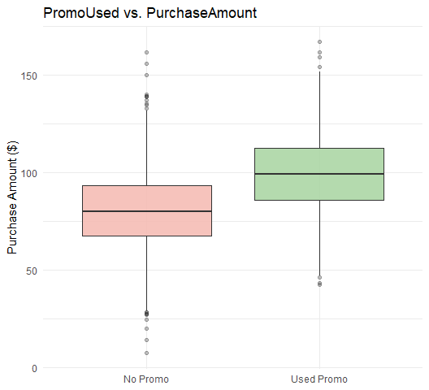<!-- -->

**Step 5b: Correlation Matrix (Candidates Plus Target)**

``` r
candidate_all <- c(candidate_continuous, "PromoUsed", "PurchaseAmount")
cor_matrix_step5 <- cor(df[, candidate_all], use = "complete.obs")
round(cor_matrix_step5["PurchaseAmount", ], 3) %>% sort(decreasing = TRUE)
```

    ##    PurchaseAmount            Income         PromoUsed       PagesViewed 
    ##             1.000             0.583             0.436             0.373 
    ##     WebsiteVisits        TimeOnSite        EmailOpens               Age 
    ##             0.294             0.005             0.004             0.000 
    ##            Clicks     AdImpressions SatisfactionScore 
    ##            -0.005            -0.006            -0.008

**Step 5c: VIF Check on the Shortlist**

``` r
library(car)

# Update this formula with your top candidates once you see the real correlation numbers
candidate_model <- lm(PurchaseAmount ~ TimeOnSite + Income + WebsiteVisits + PromoUsed + SatisfactionScore, data = df)
vif(candidate_model)
```

    ##        TimeOnSite            Income     WebsiteVisits         PromoUsed 
    ##          1.000716          1.001361          1.000355          1.001382 
    ## SatisfactionScore 
    ##          1.000665

``` r
model2_candidate <- lm(PurchaseAmount ~ Income + PromoUsed + PagesViewed + WebsiteVisits, data = df)
vif(model2_candidate)
```

    ##        Income     PromoUsed   PagesViewed WebsiteVisits 
    ##      1.001380      1.001660      1.000433      1.000246

## Step 5: Predictor Selection Process

**Step 5a. Visual screening:** Every candidate predictor was plotted
against `PurchaseAmount`, with a fitted linear trend and its correlation
coefficient labeled directly on each panel. This gave an immediate
visual read on which variables carried real signal versus which were
essentially flat noise. `Income` and `PagesViewed` showed clear upward
slopes; `WebsiteVisits` showed a milder but real slope; `PromoUsed`’s
boxplot showed a clear median shift between groups. Every other
candidate (`Age`, `Clicks`, `EmailOpens`, `AdImpressions`,
`SatisfactionScore`, `TimeOnSite`) showed a visually flat trend line.

**Step 5b. Correlation matrix:** This confirmed the visual screening
numerically, and revealed a striking natural cutoff: four predictors
(`Income` = 0.583, `PromoUsed` = 0.436, `PagesViewed` = 0.373,
`WebsiteVisits` = 0.294) sat in a completely different tier from every
other variable, which all clustered within ±0.008 of zero. This made the
choice of exactly which four predictors to shortlist essentially
unambiguous, driven by the data rather than a judgment call.

**Step 5c. VIF (multicollinearity check):** Before finalizing the four
predictors, a VIF check confirmed they don’t meaningfully overlap with
each other (all values ≈ 1.0, far below the concern threshold of 5).
This means each predictor contributes genuinely independent explanatory
power, rather than several variables competing to explain the same
underlying signal.

**Result:** The final Model 2 predictor set is `Income`, `PromoUsed`,
`PagesViewed`, and `WebsiteVisits`, four variables, evidence-selected,
and confirmed non-redundant.

**Step 5d: Assumption Checks for Model 2**

``` r
library(lmtest)
library(car)

model2_prelim <- lm(PurchaseAmount ~ Income + PromoUsed + PagesViewed + WebsiteVisits, data = df)

cat("--- Breusch-Pagan (Homoscedasticity) ---\n")
```

    ## --- Breusch-Pagan (Homoscedasticity) ---

``` r
print(bptest(model2_prelim))
```

    ## 
    ##  studentized Breusch-Pagan test
    ## 
    ## data:  model2_prelim
    ## BP = 2.3799, df = 4, p-value = 0.6663

``` r
cat("\n--- Durbin-Watson (Independence of Residuals) ---\n")
```

    ## 
    ## --- Durbin-Watson (Independence of Residuals) ---

``` r
print(dwtest(model2_prelim))
```

    ## 
    ##  Durbin-Watson test
    ## 
    ## data:  model2_prelim
    ## DW = 2.0131, p-value = 0.6793
    ## alternative hypothesis: true autocorrelation is greater than 0

``` r
cat("\n--- Shapiro-Wilk (Normality of Residuals) ---\n")
```

    ## 
    ## --- Shapiro-Wilk (Normality of Residuals) ---

``` r
set.seed(42)
resid_vals <- residuals(model2_prelim)
resid_sample <- if (length(resid_vals) > 5000) sample(resid_vals, 5000) else resid_vals
print(shapiro.test(resid_sample))
```

    ## 
    ##  Shapiro-Wilk normality test
    ## 
    ## data:  resid_sample
    ## W = 0.9997, p-value = 0.7172

``` r
cat("\n--- VIF (Multicollinearity, re-confirmed on final model) ---\n")
```

    ## 
    ## --- VIF (Multicollinearity, re-confirmed on final model) ---

``` r
print(vif(model2_prelim))
```

    ##        Income     PromoUsed   PagesViewed WebsiteVisits 
    ##      1.001380      1.001660      1.000433      1.000246

``` r
diag_df2 <- data.frame(
  fitted = fitted(model2_prelim),
  resid = residuals(model2_prelim),
  std_resid = rstandard(model2_prelim)
)

p1 <- ggplot(diag_df2, aes(x = fitted, y = resid)) +
  geom_point(alpha = 0.25, size = 1, color = "#5B8FB9") +
  geom_hline(yintercept = 0, color = "#D9534F", linetype = "dashed", linewidth = 0.8) +
  geom_smooth(method = "loess", se = FALSE, color = "#F0A500", linewidth = 0.9) +
  theme_minimal() +
  labs(title = "Residuals vs. Fitted", subtitle = "Checks: Linearity & Homoscedasticity",
       x = "Fitted Values", y = "Residuals")

p2 <- ggplot(diag_df2, aes(sample = std_resid)) +
  stat_qq(alpha = 0.4, size = 1, color = "#8E7CC3") +
  stat_qq_line(color = "#D9534F", linewidth = 0.9) +
  theme_minimal() +
  labs(title = "Normal Q-Q Plot", subtitle = "Checks: Normality of Residuals",
       x = "Theoretical Quantiles", y = "Standardized Residuals")

p3 <- ggplot(diag_df2, aes(x = resid)) +
  geom_histogram(aes(y = after_stat(density)), bins = 40, fill = "#A7D3A0", color = "white", alpha = 0.85) +
  geom_density(color = "#2C5F2D", linewidth = 1) +
  stat_function(fun = dnorm, args = list(mean = mean(diag_df2$resid), sd = sd(diag_df2$resid)),
                color = "#D9534F", linetype = "dashed", linewidth = 0.9) +
  theme_minimal() +
  labs(title = "Distribution of Residuals", subtitle = "Green = actual density | Red dashed = normal curve",
       x = "Residuals", y = "Density")

p4 <- ggplot(diag_df2, aes(x = fitted, y = sqrt(abs(std_resid)))) +
  geom_point(alpha = 0.25, size = 1, color = "#5B8FB9") +
  geom_smooth(method = "loess", se = FALSE, color = "#F0A500", linewidth = 0.9) +
  theme_minimal() +
  labs(title = "Scale-Location Plot", subtitle = "Checks: Homoscedasticity (spread)",
       x = "Fitted Values", y = expression(sqrt("|Standardized Residuals|")))

(p1 + p2) / (p3 + p4) + plot_annotation(
  title = "Step 5d: Model 2 Assumption Checks",
  theme = theme(plot.title = element_text(size = 15, face = "bold"))
)
```

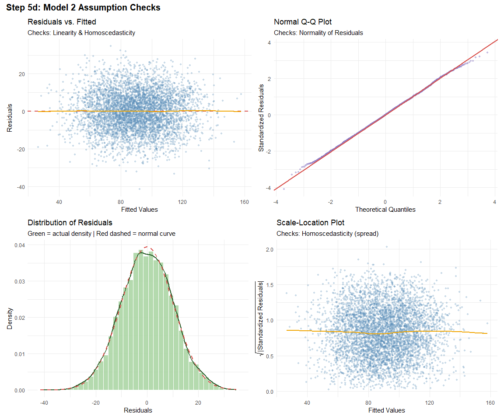<!-- -->

``` r
predictors <- c("Income", "PromoUsed", "PagesViewed", "WebsiteVisits")
coefs <- coef(model2_prelim)

partial_resid_df <- lapply(predictors, function(p) {
  partial_resid <- residuals(model2_prelim) + coefs[p] * df[[p]]
  data.frame(Predictor = p, x = df[[p]], partial_resid = partial_resid)
}) %>% bind_rows()

ggplot(partial_resid_df, aes(x = x, y = partial_resid, color = Predictor)) +
  geom_point(alpha = 0.2, size = 0.7) +
  geom_smooth(method = "lm", color = "black", linewidth = 0.7, se = FALSE) +
  geom_smooth(method = "loess", color = "#D9534F", linetype = "dashed", linewidth = 0.7, se = FALSE) +
  facet_wrap(~Predictor, scales = "free_x") +
  scale_color_brewer(palette = "Pastel1") +
  theme_minimal() +
  theme(legend.position = "none") +
  labs(title = "Component + Residual Plots (Per-Predictor Linearity Check)",
       subtitle = "Solid black = linear fit  |  Dashed red = loess fit  (close overlap supports linearity)",
       x = "Predictor Value", y = "Partial Residual + Component")
```

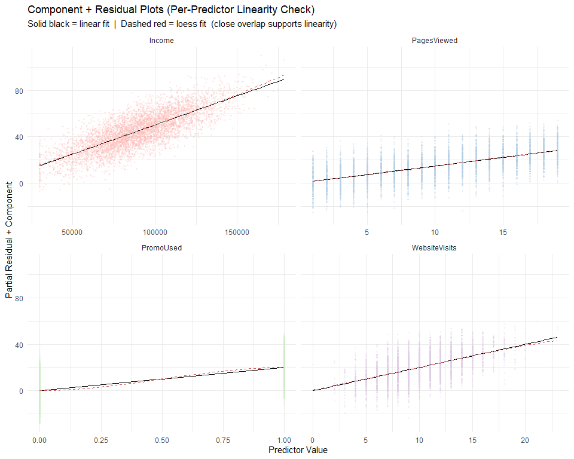<!-- -->

## Step 5d: Insights: Model 2 Assumption Checks

Model 2 satisfies every core OLS assumption cleanly:

- **Homoscedasticity:** BP p = 0.666, no evidence of non-constant
  variance; both the Residuals vs. Fitted and Scale-Location plots show
  a flat, even spread with no funnel shape.
- **Independence:** DW p = 0.679, residuals show no autocorrelation.
- **Normality:** Shapiro p = 0.717, residuals are statistically
  indistinguishable from normal, and the Q-Q plot confirms it, tracking
  the diagonal almost perfectly with barely any tail deviation (a clear
  improvement over Model 1, where normality was technically violated).
- **Multicollinearity:** all VIF values ≈ 1.0. The four predictors
  remain fully independent of each other, as expected from Step 5c.
- **Linearity (per predictor):** the component+residual plots show the
  solid (linear) and dashed (loess) lines overlapping almost exactly for
  all four predictors. `Income`, `PagesViewed`, `PromoUsed`, and
  `WebsiteVisits` all show genuinely linear relationships with the
  outcome, with no visible curvature to suggest a transformation is
  needed for any of them.

**Takeaway:** Model 2 is a well-behaved multiple regression with no
assumption violations to flag, a strong, defensible model as is, and a
clean benchmark for Model 3 to try to improve upon.

**Step 5d: Model 2.Final Fit and Output**

**Equation:**

$$\widehat{PurchaseAmount} = \beta_0 + \beta_1 \times Income + \beta_2 \times PromoUsed + \beta_3 \times PagesViewed + \beta_4 \times WebsiteVisits$$

``` r
model2 <- lm(PurchaseAmount ~ Income + PromoUsed + PagesViewed + WebsiteVisits, data = df)
summary(model2)
```

    ## 
    ## Call:
    ## lm(formula = PurchaseAmount ~ Income + PromoUsed + PagesViewed + 
    ##     WebsiteVisits, data = df)
    ## 
    ## Residuals:
    ##     Min      1Q  Median      3Q     Max 
    ## -41.550  -6.915   0.003   6.964  34.700 
    ## 
    ## Coefficients:
    ##                 Estimate Std. Error t value Pr(>|t|)    
    ## (Intercept)   -1.386e-02  7.580e-01  -0.018    0.985    
    ## Income         5.027e-04  5.666e-06  88.729   <2e-16 ***
    ## PromoUsed      2.001e+01  2.869e-01  69.757   <2e-16 ***
    ## PagesViewed    1.480e+00  2.620e-02  56.492   <2e-16 ***
    ## WebsiteVisits  2.002e+00  4.519e-02  44.295   <2e-16 ***
    ## ---
    ## Signif. codes:  0 '***' 0.001 '**' 0.01 '*' 0.05 '.' 0.1 ' ' 1
    ## 
    ## Residual standard error: 10.13 on 4995 degrees of freedom
    ## Multiple R-squared:  0.7769, Adjusted R-squared:  0.7767 
    ## F-statistic:  4349 on 4 and 4995 DF,  p-value: < 2.2e-16

``` r
confint(model2)
```

    ##                      2.5 %       97.5 %
    ## (Intercept)   -1.499958476 1.472238e+00
    ## Income         0.000491629 5.138447e-04
    ## PromoUsed     19.448152202 2.057290e+01
    ## PagesViewed    1.428835151 1.531570e+00
    ## WebsiteVisits  1.913120288 2.090307e+00

``` r
predictions2 <- predict(model2)
actuals <- df$PurchaseAmount

rmse2 <- sqrt(mean((actuals - predictions2)^2))
mae2 <- mean(abs(actuals - predictions2))
r2_2 <- summary(model2)$r.squared
adj_r2_2 <- summary(model2)$adj.r.squared

cat("R-squared:", round(r2_2, 4), "\n")
```

    ## R-squared: 0.7769

``` r
cat("Adjusted R-squared:", round(adj_r2_2, 4), "\n")
```

    ## Adjusted R-squared: 0.7767

``` r
cat("RMSE: $", round(rmse2, 2), "\n")
```

    ## RMSE: $ 10.13

``` r
cat("MAE: $", round(mae2, 2), "\n")
```

    ## MAE: $ 8.12

**Standardized Coefficient Visualization (fair comparison across
variables)**

``` r
library(broom)

df_scaled <- df %>% mutate(across(c(Income, PagesViewed, WebsiteVisits, PurchaseAmount), scale))
model2_scaled <- lm(PurchaseAmount ~ Income + PromoUsed + PagesViewed + WebsiteVisits, data = df_scaled)
coef_df <- tidy(model2_scaled, conf.int = TRUE) %>% filter(term != "(Intercept)")

ggplot(coef_df, aes(x = reorder(term, estimate), y = estimate, fill = p.value < 0.05)) +
  geom_col(width = 0.55, alpha = 0.85) +
  geom_errorbar(aes(ymin = conf.low, ymax = conf.high), width = 0.15, color = "grey30") +
  geom_hline(yintercept = 0, linetype = "dashed", color = "grey50") +
  coord_flip() +
  scale_fill_manual(values = c("TRUE" = "#A7D3A0", "FALSE" = "#F4B8B0"),
                     labels = c("TRUE" = "Significant (p<0.05)", "FALSE" = "Not significant"), name = NULL) +
  theme_minimal() +
  labs(title = "Model 2: Standardized Coefficients with 95% CI",
       subtitle = "Standardized so all predictors are on the same scale, for fair comparison",
       x = NULL, y = "Standardized Coefficient (Beta)")
```

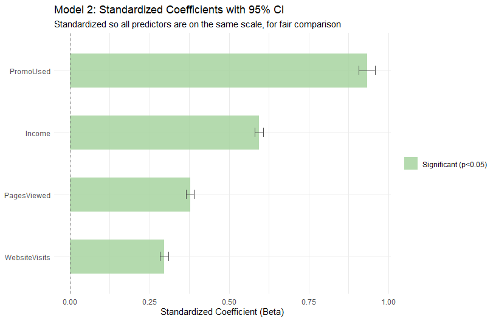<!-- -->

**Actual vs. Predicted**

``` r
pred_df2 <- data.frame(actual = actuals, predicted = predictions2)

ggplot(pred_df2, aes(x = actual, y = predicted)) +
  geom_point(alpha = 0.25, size = 1, color = "#B39DDB") +
  geom_abline(slope = 1, intercept = 0, color = "#D9534F", linetype = "dashed", linewidth = 1) +
  annotate("text", x = min(pred_df2$actual) + 15, y = max(pred_df2$predicted) - 5,
           label = paste0("R\u00b2 = ", round(r2_2, 3), "\nRMSE = $", round(rmse2, 2)),
           hjust = 0, size = 4.2, fontface = "bold", color = "#2C5F2D") +
  theme_minimal() +
  labs(title = "Model 2: Actual vs. Predicted Purchase Amount",
       subtitle = "Dashed red line = perfect prediction (actual = predicted)",
       x = "Actual Purchase Amount ($)", y = "Predicted Purchase Amount ($)")
```

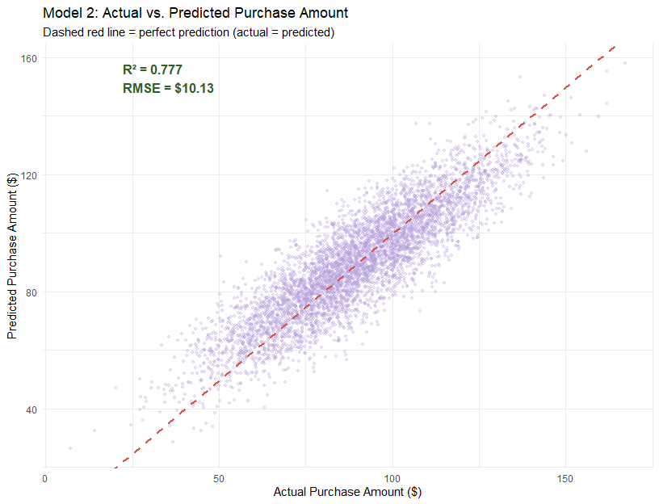<!-- -->

## Step 5e: Insights: Model 2 (Multiple Regression)

**Model 2 dramatically outperforms Model 1.** R^2 jumped from 0.340
(Income alone) to **0.777**. Four predictors together explain **77.7%**
of the variance in `PurchaseAmount`, compared to just 34% before. RMSE
fell from \$17.42 to **\$10.13**, and MAE fell from \$14.13 to
**\$8.12**, on average, this model’s predictions land within about \$8
of the true purchase amount, a substantial accuracy gain.

**All four predictors are significant and their 95% CIs exclude zero**,
confirming genuine, non-random effects: - **Income:** +\$5.03 per
\$10,000 increase (CI: \$4.92–\$5.14 per \$10K) - **PromoUsed:**
+\$19.45 to +\$20.57, the single largest lift of any predictor -
**PagesViewed:** +\$1.43 to +\$1.53 per additional page -
**WebsiteVisits:** +\$1.91 to +\$2.09 per additional visit

**Standardized coefficients reveal the true ranking of importance** (raw
dollar coefficients can’t be compared directly since they’re on
different scales). Once standardized, the order is: **PromoUsed \>
Income \> PagesViewed \> WebsiteVisits**. This is a genuinely
interesting finding: `PromoUsed`, a simple binary flag, outweighs
`Income` in standardized effect size, meaning a customer’s *engagement
with a promotion* moves the needle on spending more than their income
bracket does. That’s a strong, actionable marketing insight: promo
strategy may be a more powerful lever than income-based targeting alone.

**The actual-vs-predicted plot confirms this numerically strong fit
visually**. Points hug the diagonal far more tightly than they did in
Model 1’s equivalent plot, with only modest scatter at the extremes
(very low and very high actual purchase amounts), where the model
slightly under- and over-predicts respectively.

**Bottom line:** adding `PromoUsed`, `PagesViewed`, and `WebsiteVisits`
to `Income` didn’t just improve the model incrementally, it more than
doubled the explained variance. This strongly validates the Step 5a–5c
predictor selection process, and sets a high bar (R^2 = 0.777, RMSE =
\$10.13) for Model 3 to try to beat.

**HELLO**

# Part B: Diagnostic Testing

*(To fill in together 014 linearity, normality, homoscedasticity,
multicollinearity, influential observations.)*
